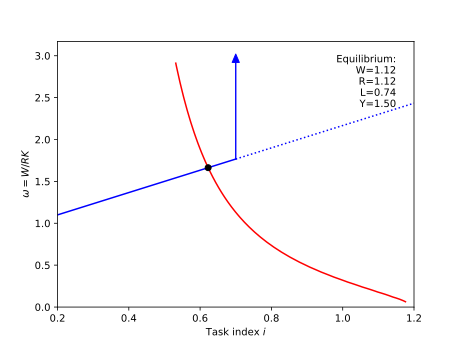

## Computing the general equilibrium of the static model in Acemoglu & Restrepo (2018) "The Race Between Man and Machine".

For simplictiy, I've adopted Acemoglu & Restrepo's *Assumption 2*, which states that $\eta=0$ and $\bar{B}=1$. I've also set $\tilde{B}=1$ (which is just a choice of units). This significantly simplifies the equations.

The code contains a base class, StaticModel, which is general for any choice of $\gamma(i)$ and $\nu(L)$, and a subclass which specifies $\gamma(i)$ and $\nu(L)$. I've used  $\gamma(i) = a + bi$ and $\nu(L) = \frac{1}{2}L^2$, but these can be modified so long as gamma_integral() is updated to be consistent with gamma(i).

The PDF (Derivation of Acemoglu & Restrepo 2018 static model equilibrium.pdf) contains step-by-step derivations of the static model equilibrium.

#### Running the code: 
Requirements: numpy, scipy, matplotlib

Clone the repository and run main.py. This will create a plot like the one shown below. The plot shows Figure 3 in Acemoglu & Restrepo's paper (for the choice of parameters defined in the code), and it displays the equilibrium wage (W), capital rental rate (R), labor employment (L), and production (Y).

